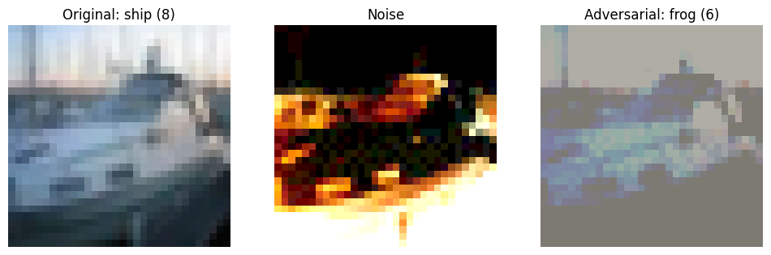

# Adversarial Attacks Evaluation on ResNet-20

This repository contains the implementation for the first part of the "Trustworthy AI" project. In this section, we tackle the challenge of evaluating the robustness of deep learning models against various adversarial attacks.

## Project Objectives
- Evaluate the baseline accuracy of a pre-trained ResNet-20 model.
- Implement the Fast Gradient Sign Method (FGSM).
- Implement Projected Gradient Descent (PGD) and PGD with Momentum.
- Implement AutoPGD with Cross-Entropy (CE) and Carlini-Wagner (CW) losses.
- Investigate the impact of different hyperparameters (e.g., epsilon, step size, momentum) on the attack success rates.



## Dataset
This project uses the **CIFAR-10** dataset, which consists of 10 distinct image classes.

For detailed information on how to set up the data, please refer to the `data/README.md` file.

## Key Results
The implementation of various adversarial attacks demonstrated a significant drop in the model's accuracy, showing its vulnerability to small, targeted perturbations.

- **Baseline Accuracy (Clean Data):** ~92.60%
- **Accuracy under FGSM ($\epsilon=0.1$):** ~30.40%
- **Accuracy under PGD ($\epsilon=0.1$, $\alpha=0.01$, steps=40):** ~0.76%
- **Accuracy under PGD with Momentum:** ~1.11%
- **Accuracy under AutoPGD (CE loss):** ~6.43%

### Visualizing Adversarial Examples
The plots below illustrate how the attacks add minimal noise to the original images, successfully misleading the classifier into predicting the wrong class while the changes remain largely imperceptible to the human eye.


## Repository Structure
```text
.
├── assets/                     # Images and attack output samples
├── data/                       # CIFAR-10 dataset directory
│   └── README.md               # Dataset documentation
├── notebooks/
│   └── Q1_Adversarial_Attacks.ipynb  # Main Jupyter notebook
├── README.md                   # This file
└── requirements.txt            # Python dependencies
